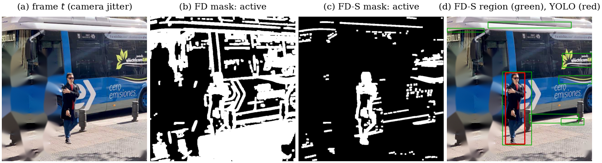
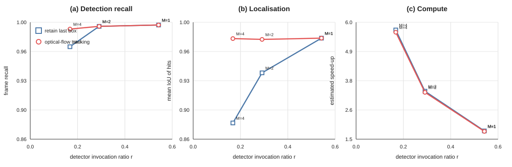

# Motion-gated person detection

[](https://github.com/yanaosinchuk/motiongate/actions/workflows/tests.yml)



`motiongate` puts a cheap motion gate (about 1–10 ms per frame) in front of a person detector (YOLOv8m, about 698 ms per 640×640 frame on one CPU thread). The detector runs on the first frame, whenever motion is detected, and at least every *K* frames. In between, the previous boxes are reused and reported together with their age. The repository contains a typed Python package, a command-line tool, an automated unit-test suite, a controlled benchmark with exact ground truth, and the LaTeX source of the accompanying paper (`paper/`).

[Read the full paper](paper/Person_Detection.pdf)

Author: Yana Osinchuk (Hochschule Darmstadt).

## Highlights

- **Guarantees instead of hope.** Two parameters: the refresh interval *K* bounds the age of every reported box by *K*−1 frames, and the minimum interval *M* caps the cost. The fraction of frames sent to the detector always lies between 1/*K* and 1/*M*, whatever happens in the scene (proof in the paper).
- **Failure modes that are predicted, not just observed.** The classic frame-differencing gate takes absolute differences *before* smoothing, so sensor noise adds a bias of 1.13σ that smoothing cannot remove. A percolation argument predicts the breakdown at σ ≈ 13.9; the benchmark measures 13.9. The same gate fires at every illumination step larger than its threshold and on sub-pixel camera jitter.
- **A stabilised gate (FD-S).** Signed differencing, phase-correlation registration with an edge-based model selection, illumination compensation and an error-propagated threshold. False triggers under camera jitter drop from 0.996 to 0.069 and under illumination steps from 0.022 to 0.000. Noise tolerance rises to σ ≈ 33.8. It costs 7.25 ms per frame.

## Results

Controlled benchmark (10 scenarios × 90 frames, YOLOv8m, *K* = 15, *M* = 1; recall = frames in which the person is reported with IoU ≥ 0.5):

| Policy | detector calls *r* | frame recall | stale frames | speed-up |
|---|---|---|---|---|
| detector on every frame | 1.000 | 0.998 | 0 | 1.00 |
| gated, frame differencing (FD) | 0.629 | 0.997 | 0 | 1.59 |
| gated, stabilised (FD-S) | 0.542 | 0.997 | 0 | 1.83 |
| gated, MOG2 | 0.557 | 0.997 | 5 | 1.76 |

At the same budget, fixed-rate subsampling matches this recall (0.997), but its boxes lag behind moving people (mean IoU 0.942 vs 0.981). At smaller budgets the rate-limited gate is clearly better: with *M* = 4 it keeps a recall of 0.971 at *r* = 0.168, where fixed-rate subsampling reaches 0.883. The measured end-to-end run time of the online system differs from the cost-model estimate by -5.4 % (FD-S), with zero decision mismatches.

Real video (OpenCV `vtest.avi`, 795 frames, 6.0 persons per frame on average, reference = YOLOv8m on every frame): the scene is almost always in motion, so the gate is active on 0.994 of the frames and gating with *M* = 1 saves little. With *M* = 2 the stabilised gate reaches a recall of 0.952 at a speed-up of 1.95, compared with 0.952 for every second frame. The lesson is that gating pays off in scenes that are often static; in busy scenes *M* (or a tracker) bounds the cost.

All numbers are regenerated by `python -m benchmark.run` and read by the paper from `paper/generated/`.

## Quick start

```bash
pip install -e ".[yolo]"                     # package + Ultralytics
motiongate input.mp4 --max-staleness 0.5 --output annotated.mp4 --log frames.csv
motiongate 0 --show                          # webcam 0, press Esc to quit

# Optional post-paper extension: propagate boxes between detector calls
motiongate input.mp4 --tracker flow --max-staleness 0.5 --output tracked.mp4
```

```python
from motiongate import MotionGatedDetector, SchedulerConfig, UltralyticsPersonDetector, make_gate

system = MotionGatedDetector(
    UltralyticsPersonDetector("yolov8m.pt"),
    make_gate("stabilized"),                               # "difference" | "stabilized" | "mog2"
    SchedulerConfig.from_max_staleness(seconds=0.5, fps=30, min_interval=1))
for frame in frames:                                       # BGR uint8 images
    result = system.process(frame)                         # boxes, fresh/retained, reason, age, timings
```

Choosing the parameters:

- `--max-staleness` (→ *K*) is the oldest box your application accepts.
- `--min-interval` (*M*) caps the detector rate in busy scenes.
- Use the stabilised gate if the camera can vibrate or the lighting can change.
- Use `--tracker flow` when box localisation between detector calls matters. Sparse Lucas--Kanade flow propagates boxes and requests re-detection when forward--backward tracking quality drops.

### Optional tracked mode

Version 1.1 adds an opt-in sparse optical-flow tracker. Fresh detector boxes seed Shi--Tomasi features; pyramidal Lucas--Kanade flow propagates them between detector calls, a forward--backward check rejects inconsistent tracks, and the median point displacement updates each box. If too few reliable points remain, the scheduler requests re-detection while still respecting the minimum interval `M`.

Tracking is **disabled by default**, so the paper and all reported benchmark numbers continue to use the original retain-last-box policy. Tracked frames are explicitly marked in the API/CSV output together with tracking quality and tracker runtime.

### Tracking benchmark

The post-paper comparison is reproducible separately from the paper:

```bash
python -m benchmark.tracking_run
```

It compares the original retain-last-box policy with optical-flow propagation at the same stabilised gate and refresh interval, over `M = 1, 2, 4`. Detector outputs are cached once per frame and reused by both modes, so the comparison isolates the effect of box propagation. The real YOLOv8m benchmark (10 controlled scenarios x 90 frames, `K=15`, IoU threshold 0.5) gives:

| Policy | M | detector ratio r | frame recall | mean IoU | estimated speed-up |
|---|---:|---:|---:|---:|---:|
| retain last box | 1 | 0.542 | 0.997 | 0.981 | 1.82x |
| optical flow | 1 | 0.542 | 0.997 | 0.981 | 1.80x |
| retain last box | 2 | 0.291 | 0.995 | 0.939 | 3.35x |
| optical flow | 2 | 0.291 | 0.995 | 0.979 | 3.30x |
| retain last box | 4 | 0.168 | 0.971 | 0.879 | 5.70x |
| optical flow | 4 | 0.168 | 0.992 | 0.980 | 5.62x |

At `M=2`, optical flow keeps exactly the same detector-call ratio and recall while raising mean IoU from 0.939 to 0.979; the estimated speed-up changes only from 3.35x to 3.30x. At `M=4`, tracking raises recall by 2.11 percentage points and mean IoU by 0.101 at the same detector-call ratio; the speed-up changes from 5.70x to 5.62x. The strongest practical operating point is therefore the tracked `M=4` mode: compared with the paper-style retain `M=1` configuration, it uses 69% fewer detector calls while losing only 0.49 percentage points of recall and essentially preserving mean IoU (0.9805 vs. 0.9810).



The benchmark writes:

- `results/tracking_controlled.csv` -- aggregate recall, mean IoU, detector ratio, stale frames and estimated runtime;
- `results/tracking_scenarios.csv` -- the same metrics per controlled scenario;
- `figures/fig_tracking_comparison.{png,pdf}` -- recall, localisation and compute trade-offs;
- `results/tracking_metadata.json` -- environment and experiment configuration.

These are post-paper results; the seminar paper and its original generated numbers remain unchanged.

## Reproducing the paper

```bash
mkdir -p weights data
python -c "from ultralytics import YOLO; YOLO('yolov8m.pt'); YOLO('yolov8n-seg.pt')" && mv yolov8m.pt yolov8n-seg.pt weights/
curl -L -o data/vtest.avi https://raw.githubusercontent.com/opencv/opencv/4.x/samples/data/vtest.avi
pip install -e ".[benchmark,dev]"            # exact versions: requirements.txt
pytest                                       # unit tests
python -m benchmark.run                      # ~35 min on one CPU thread; --budget 600 runs it in resumable chunks
cd paper && latexmk -pdf main.tex
```

## Repository layout

```
src/motiongate/   gates, scheduler, optical-flow tracker, detector wrapper, theory, CLI
benchmark/        synthetic scenes, metrics, policies, experiment stages, plotting/reporting, thin runner
tests/            unit tests (configuration, gates, scheduler, CLI, online/offline equivalence, theory)
paper/            university-formatted LaTeX source, generated tables, figures and compiled paper
results/          raw CSV/JSON results;  figures/  generated figures
legacy/           the original prototype, kept for reference
```

## Development

The core package deliberately keeps heavy detector dependencies optional. For code-quality checks and unit tests:

```bash
pip install -e ".[dev]"
ruff check src tests benchmark
ruff format src tests benchmark
pytest -q
```

GitHub Actions runs the same lint-and-test checks on every push and pull request. Invalid configuration is rejected explicitly rather than silently clamped, and the benchmark is split into independent policy, experiment, plotting and reporting modules so the research pipeline can be tested and extended without turning the runner into a monolithic script.

## Limitations

- The controlled benchmark uses one background and one composited person.
- FD-S was designed on the controlled benchmark; the real video is the held-out check.
- The real-video reference is the detector itself, so it measures agreement, not accuracy.
- FD-S models global translation only (no rotation, zoom or parallax).
- Timings come from a single CPU thread; see the paper for details.

## License

AGPL-3.0 (see `LICENSE`), because the detector wrapper builds on Ultralytics YOLOv8, which is AGPL-3.0 licensed.
